# Recopilación de Resultados Gráficos de Lotka-Volterra

-----
## De L-V_calculo_manual

### Sistema Determinístico con poblaciones iniciales normales
En este ejemplo son 10 conejos y 5 zorros
- Diagrama Poblacional: \
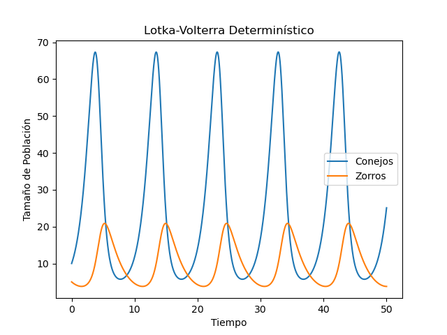
- Diagrama de Fase: \
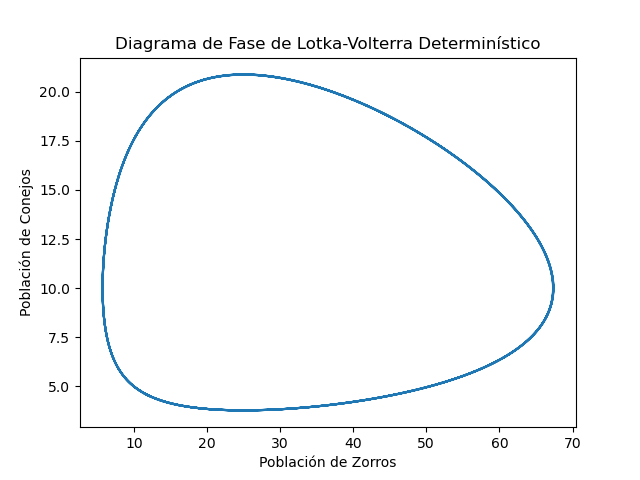
- Diagrama Poblacional de Zorros: \
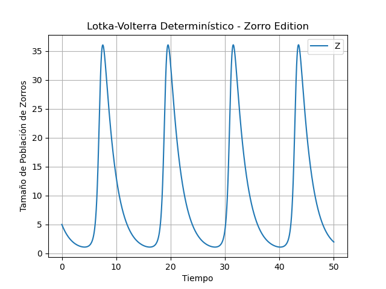
- Este gráfico es solo para demostrar que, aunque en otros gráficos pareciera que los Zorros llegan a 0 y 
que luego resucitan, no lo hacen. Los Zorros nunca mueren, y sostener dicha postura es erróneo, equívoco y desacertado.
- Así que, estimado lector. Si en algún futuro cambia algún parámetro del código, y ve que alguna población muere 
y resucita, le recomiendo que, primero rece un padre nuestro, y segundo, haga un gráfico de la población aislada, para 
comprobar si simplemente se trata de un problema de visualización debido a las escalas, 
o si el poder de Jesús interfiere con su código.

### Sistema Determinístico con poblaciones iniciales de equilibrio
En este ejemplo son (r2/a) conejos y (r1/p) zorros. Es decir, las poblaciones empiezan ya equilibradas
- Diagrama Poblacional: \
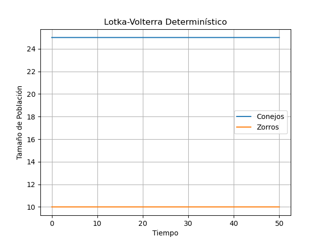
- Diagrama de Fase: \
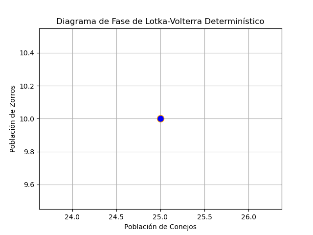

### Sistema Estocástico con poblaciones iniciales normales
En este ejemplo son 10 conejos y 5 zorros
- Diagrama Poblacional: \
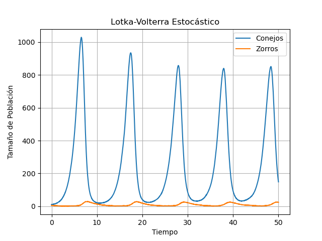
- Diagrama Poblacional de Zorros: \
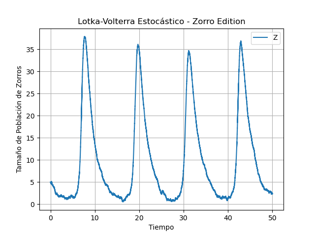
Nuevamente, verificamos que los zorros no mueren. Símplemente es la escala del gráfico anterior
que nos hace una bromita. \
Jajaja que ocurrente doctor...
- Diagrama de Fase:
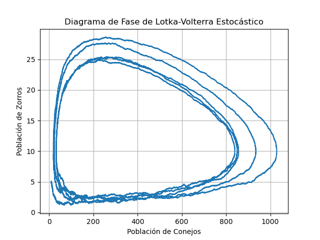
### Sistema Estocástico con poblaciones iniciales de equilibrio
En este ejemplo son (r2/a) conejos y (r1/p) zorros. Es decir, las poblaciones empiezan ya equilibradas
Que  en este caso particular son: x=25.0 e y=10.0
- Diagrama Poblacional: \
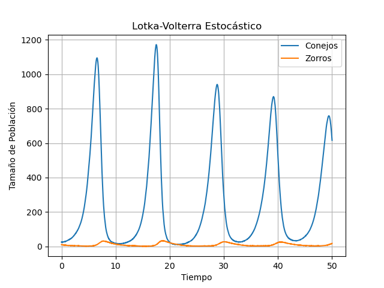
- Diagrama Poblacional de Zorros: \
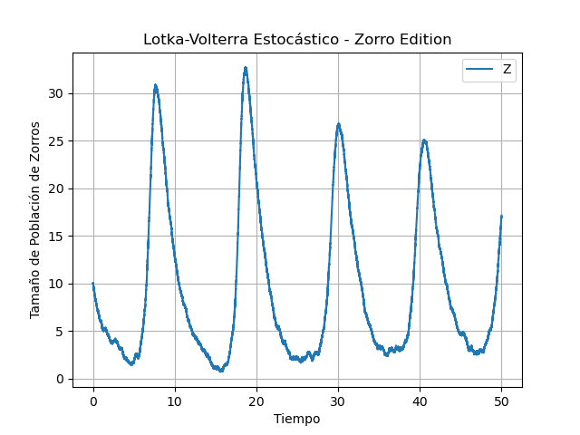
- Diagrama de Fase: \
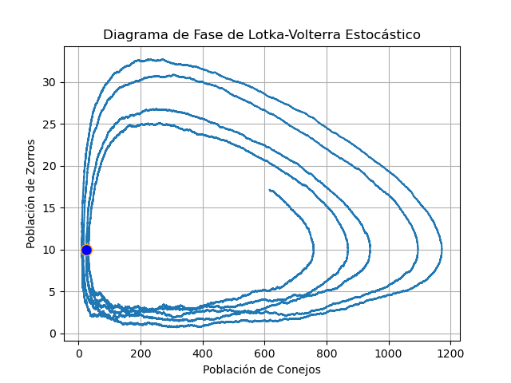
Obsérvese cómo en este diagrama de fase ninguna población se hace 0.
Y cómo se rejunta todo más cerca del pto. de equilibrio.\
Y como recordatorio, léanse los gráficos de fase en sentido antihorario: Decrecen los Zorros -> Crecen los Conejos

## De L-V_automático

Acá se usa "odeint" para calcular todo, dejandolo a manos de tu procesador Celeron y 
cualquiera que sea tu version de Python. \

A continuación, se verán los resultados de la función Logística del modelo Predador-Presa, 
porque es la versión optimizada del sistema. Donde se muestra un comportamiento de oscilación que tiende a buscar el
punto de equilibrio de ambas poblaciones. Y porque mi salud mental me lo pide.

No se va a hacer distinción entre Determinístico ni Estocástico. ¿Por qué? Porque no. \
En cambio, vamos a distinguir entre poner la bendita "p" de probabilidad en la ecuación de "dy" y del pto. de equilibrio.
Porque aunque no parezca, meter ese 0.loquesea, rompe los gráficos más allá de mi entendimiento. \
Y es raro, porque en algunas fuentes la ponen y en otras no.

Las ecuaciones en cuestión son: \
dy = - r2 * con_ini[1] + a * con_ini[0] * con_ini[1] * **p** \
y \
x_equil = r2 / (**p** * a)

### Poniendo la P en las ecuaciones:

- Diagrama Poblacional o de Elongación: \
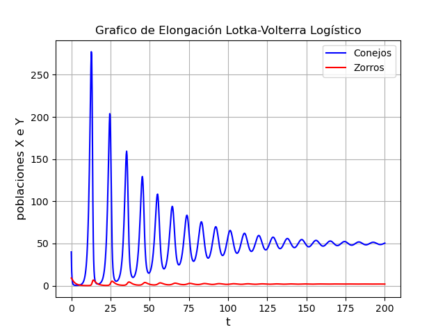
- Diagrama Poblacional de Zorros: \
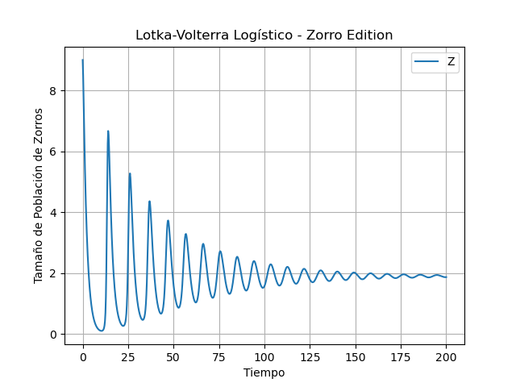
  - Añado este gráfico para demostrar, que pese a la fealdad del gráfico anterior, los Zorros no mueren
- Diagrama de Fase: \
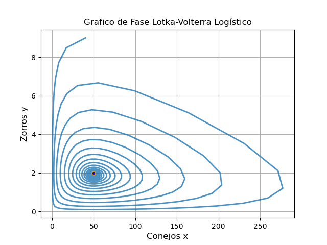

### Sacando la P en las ecuaciones:
- Diagrama Poblacional o de Elongación: \
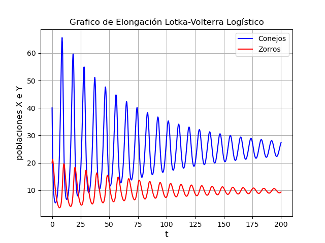
  - Podrán notar que no hace falta incluir el gráfico de Zorros 

- Diagrama de Fase: \
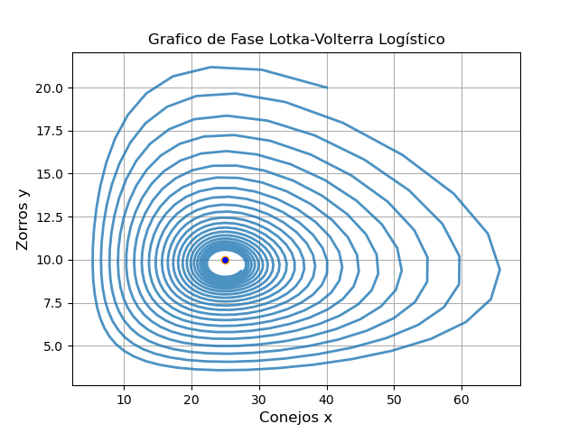
  - se ve perfectamente el comienzo de las poblaciones y como el espiral va al equilibrio

En fin, simplemente se logra una superioridad estética al quitar esa bienaventurada **P** de las ecuaciones.

### Yapa:
Esto pasa cuando se inicia las poblaciones en equilibrio usando la forma Logística \
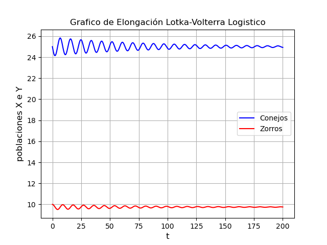 \
Se ven los cambios mínimos en las poblaciones y cómo la oscilación va disminuyendo 
y acercándose cada vez más a los valores iniciales (que son los de equilibrio).

### Yapa 2: el Enrique Contraataca 
#### Extracto de: MODELOS Y SIMULACIÓN - CAPÍTULO 2 REV. 15.04.03 - de ENRIQUE PULIAFITO
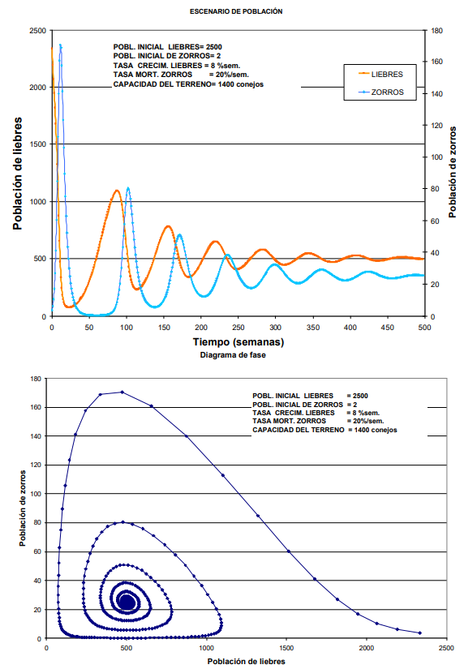 \
Acá se puede ver unos gráficos extraídos de donde aclara el título de esta sección.
Aclaro, el programa usado para esos graficos fue escrito en C, no en Python. Pero eso no importa. 

Lo importante es que parece que por un momento, los zorros se arrastran por el eje X, haciéndose 0.

Pero por favor, démosle al venerado don Enrique el beneficio de la duda. \
Lo que nos lleva a:

#### Extracto de: MODELOS Y SIMULACIÓN - CAPÍTULO 5 REV. 7.08.03 - de ENRIQUE PULIAFITO
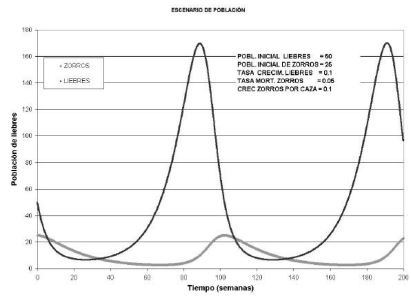 \
Y acá, capítulos más adelante, se ve que ninguna población se hace 0. Aleluya Aleluya! \
Incluso se puede notar la similitud con los gráficos obtenidos previamente, particularmente, los de Sistema Estocástico. \
Donde la gráfica de los Zorros tiene como forma de duna.

# Conclusión:
No importa que tan rara se vea la gráfica, la tuya, la mía o la de Enrique; todas están basadas en un modelo matemático,
donde se usa el valor anterior para calcular el siguiente, donde si una población efectivamente se iguala
a 0, muere, queda out of the equation... todo el sistema cambia, deja de oscilar. \
Y eso es porque el crecimiento de ambas poblaciones dependen la una de la otra.
Así que si ves que una curva se toma un descanso en un eje, no dudes, confía en las matemáticas... Porque a veces Python
hace lo que quiere. 

Además, hay que acordarse que es un Sistema No Lineal, por lo que cualquier cambio en las variables y parámetros 
iniciales va a provocar cambios notables en los resultados.

Fin

?

### Yapa 3: el retorno de la P
Se supone que el objetivo de un modelo es plantear matemáticamente un sistema que represente la realidad con la mayor 
fidelidad posible. Lo que me ha llevado a pensar un replanteo en las ecuaciones.
 - Estimado lector, lo que a continuación se describe NO ha sido implementado en el código, ya que al momento de 
escribir esto, me encuentro a horas de rendir un examen. 
 - Esto se debe tomar como un ejercicio mental y de lógica. 
 - Yo no soy un matemático profesional, simplemente soy un alumno al que le molesta ver gráficos feos. 
 - Teniendo esto en cuenta, continuemos

Recordemos entonces:
La ecuación poblacional de los zorros --> dY =  a * P * X * Y - r2 * Y \
Donde:
- r2 : tasa de mortalidad de los zorros (en ausencia de conejos)
- P : el coeficiente de probabilidad de caza (0< P <1);
- a : tasa de nacimiento de zorros por cada conejo cazado.

Sabiendo que multiplicar esa "a" por la "p" hace los gráficos se vean mal y que la población de zorros llegue al borde 
de la extinción, quiero ponderar sobre la definición de "a"
- tasa de nacimiento de zorros **por cada conejo cazado.**

Esto me hace pensar que en lugar de hacer:
- a * p 

Nos encontramos frente a una función: **a(p)**. \
Es decir el valor de "a" ya incluiría su relación con "p", porque es **"tasa de nacimiento por cacería"** \
Por lo que multiplicarlos nuevamente dentro de "dY" sería, en mi opinion personal y nada profesional, redundante 
y contraproducente.

Ahora, cuál es la forma de esta nueva función **a(p)**, no lo sé, habría que encontrarla. 
Pero sabemos que: 

lim a(p) = 0.02 \
p -> 0.1

(estos valores numéricos han sido extraídos del código)

La cuestión es que sea cual sea la forma de esta ecuación, debería ajustarse a la realidad, y para eso hay que recurrir 
a la Estadística. Lo cual es tema de otra materia, por lo que no voy a explayarme sobre eso en este momento. \
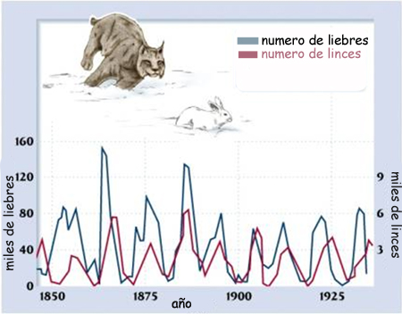 \
Tomando esta imágen de referencia, muy humilde y no profesionalmente, yo diría que se parece más a los gráficos donde la
"p" no está multiplicando a la "a"